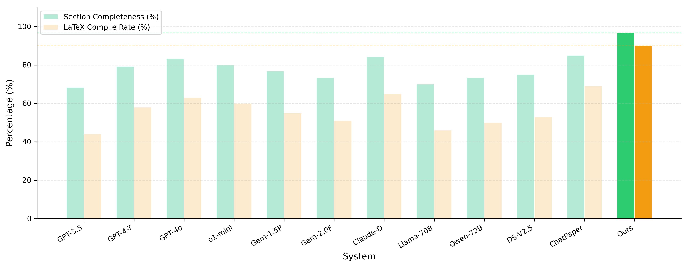
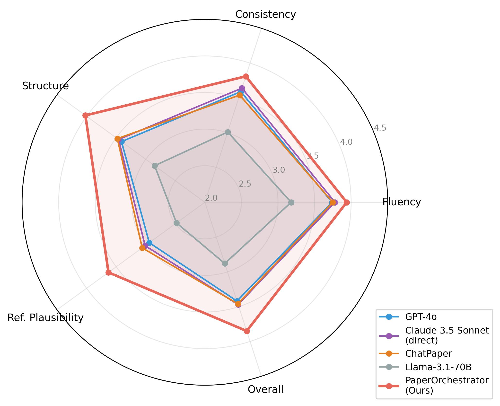
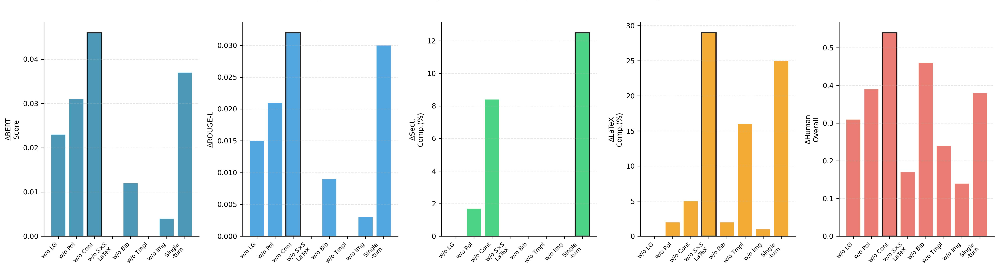
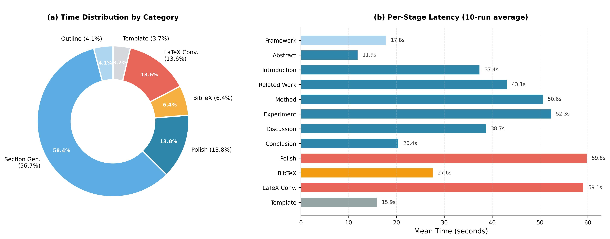

# PaperOrchestrator

> An LLM-orchestrated multi-agent pipeline for automated end-to-end scientific paper writing.

<p align="center">
  
</p>

<p align="center">
  
</p>

## Overview

**PaperOrchestrator** is a structured academic writing system that turns research materials into a paper draft, a LaTeX manuscript, and a BibTeX reference file.

Instead of relying on a single long-form generation call, the system decomposes paper writing into a controlled multi-stage pipeline with shared context, section-wise generation, length control, consistency polishing, BibTeX drafting, robust section-by-section LaTeX conversion, and journal-template rendering.

The current implementation supports:

- **Gradio-based interactive UI**
- **English and Chinese output**
- **Section-by-section academic paper generation**
- **Best-effort continuation for truncated model outputs**
- **Length control for major sections**
- **Figure/image injection into LaTeX**
- **BibTeX draft generation**
- **Journal LaTeX template ZIP rendering**
- **Export of `paper.md`, `main.tex`, `refs.bib`, and figures as a ZIP bundle**

## Highlights

- **Structured pipeline instead of single-turn generation**
- **Shared state management with `PaperContext`**
- **Continue mechanism for long outputs**
- **Length guard for section balance**
- **Full-paper polishing for consistency**
- **Section-by-section robust LaTeX generation**
- **Template-aware journal rendering**
- **Gradio UI for end-to-end usage**

## Repository Structure

```text
paper-orchestrator/
├── app/
│   └── gradio_app.py              # Gradio UI entrypoint; collects user inputs, runs pipeline, previews outputs, exports ZIP
├── core/
│   ├── __init__.py                # Minimal package initializer to avoid heavy imports / circular dependencies
│   ├── agent.py                   # Main writing agent; section generation, length control, polishing, LaTeX conversion, image injection
│   ├── biblio.py                  # BibTeX prompt builder and LLM-based BibTeX draft generation
│   ├── checker.py                 # Lightweight LaTeX completeness checker wrapper
│   ├── config.py                  # Agent and pipeline runtime configuration dataclasses
│   ├── context.py                 # Shared PaperContext state container for inputs, intermediate sections, and outputs
│   ├── exporter.py                # Writes paper.md / main.tex / refs.bib / figures and packages them into a ZIP bundle
│   ├── latex.py                   # LaTeX service for completeness checking, cleanup, retry logic, and best-effort robust generation
│   ├── pipeline.py                # End-to-end orchestration: outline → sections → polish → BibTeX → LaTeX → template rendering
│   └── templates/
│       ├── loader.py              # Loads and extracts journal template ZIPs; detects entry .tex file and insertion marker
│       └── renderer.py            # Injects generated LaTeX body and BibTeX into a copied template project
├── figure/
│   ├── 1.jpg                      # System overview / interaction workflow figure
│   ├── 2.jpg                      # Seven-stage pipeline architecture figure
│   ├── 3.jpg                      # Automated metrics comparison figure
│   ├── 4.jpg                      # Human evaluation radar chart
│   ├── 5.jpg                      # Ablation study figure
│   └── 6.jpg                      # Efficiency / latency analysis figure
├── llm/
│   ├── anthropic_client.py        # Thin Anthropic SDK wrapper with image support and continuation mechanism
│   └── prompts.py                 # Bilingual prompt pack: system prompts and stage-specific templates
├── tools/
│   └── export_requirements.py     # Utility script to scan imports and export a lightweight requirements.project.txt
└── README.md                      # Project documentation
```
## System Architecture

PaperOrchestrator is organized as a layered pipeline system:

- **UI layer (`app/`)**: Gradio-based interface for input collection, execution, preview, and export
- **Core layer (`core/`)**: shared context, writing agent, pipeline scheduler, LaTeX processing, and export logic
- **Template layer (`core/templates/`)**: journal template ZIP loading and manuscript rendering
- **LLM layer (`llm/`)**: Anthropic client wrapper and bilingual prompt definitions
- **Utility layer (`tools/`)**: dependency export helper

The end-to-end pipeline consists of seven stages:

1. **Outline Generation**
2. **Section-by-Section Content Generation**
3. **Length Guard**
4. **Full Paper Polishing**
5. **BibTeX Reference Generation**
6. **Section-by-Section LaTeX Conversion**
7. **Journal Template Rendering**

A shared `PaperContext` propagates user inputs, intermediate sections, and final outputs across all stages.

## Workflow

### Inputs

PaperOrchestrator accepts the following materials:

- `project_description`
- `model_method`
- `experiment_data`
- `seed_references`
- `figures / tables / uploaded images`
- optional `journal LaTeX template ZIP`

### Outputs

The pipeline produces:

- `paper.md` — generated paper draft
- `main.tex` or rendered manuscript entry `.tex`
- `refs.bib` — BibTeX draft
- `figures/` — copied user images
- `ZIP bundle` — packaged final outputs

## Gradio Interface

The project provides a Gradio application for interactive use.

### Main UI Flow

1. Initialize the system with:
   - `Anthropic API key`
   - optional `base URL`
   - `model name`
   - `output language`

2. Provide research materials in two groups:
   - **Experiment brief + key code**
   - **Figures / tables + results**

3. Optionally provide:
   - `seed references`
   - `journal LaTeX template ZIP`

4. Run the pipeline:
   - `outline`
   - `section generation`
   - `full-paper integration`
   - `polishing`
   - `BibTeX generation`
   - `LaTeX generation`
   - optional `template rendering`

5. Export the generated project bundle as ZIP.

## Core Modules

### `app/gradio_app.py`

Gradio UI entry point.

Responsibilities:

- initialize the writing agent
- collect user inputs
- update current status
- run the full pipeline
- preview `paper markdown / LaTeX / BibTeX`
- export the final ZIP bundle

### `core/context.py`

Defines `PaperContext`, the shared state container used across the system.

Stores:

- user input materials
- figure metadata
- uploaded image paths
- template paths
- generated sections
- full paper text
- final LaTeX
- BibTeX output

### `core/agent.py`

Defines `ClaudeWriteAgent`, the main writing agent.

Responsibilities:

- outline generation
- section generation
- bilingual prompting
- section-level length control
- full-paper integration
- consistency polishing
- LaTeX generation
- user-image injection into LaTeX

### `core/pipeline.py`

Defines `PaperPipeline`, the top-level orchestration module.

Workflow:

- generate framework
- generate sections
- integrate full paper
- optionally polish full paper
- generate BibTeX draft
- generate robust LaTeX body
- optionally render into a journal template

### `core/latex.py`

Defines `LatexService`.

Responsibilities:

- LaTeX completeness checking
- section cleanup
- best-effort robust LaTeX generation
- subsection stripping in `Discussion / Conclusion`
- retry when key LaTeX sections are missing

### `core/templates/loader.py`

Template ZIP loader.

Responsibilities:

- extract uploaded journal template ZIP
- discover candidate `.tex` files
- identify the entry `.tex` file
- detect optional insertion markers

### `core/templates/renderer.py`

Template renderer.

Responsibilities:

- copy template project to output directory
- inject generated LaTeX body
- ensure bibliography hooks exist
- write `refs.bib`

### `llm/anthropic_client.py`

Anthropic SDK wrapper.

Features:

- configurable model settings
- text generation
- image attachment support
- automatic continuation when generation is truncated

### `llm/prompts.py`

Prompt definitions.

Contains:

- English system prompt
- Chinese system prompt
- per-stage writing templates
- polish and LaTeX conversion prompts

## Key Design Ideas

### 1. Shared Context

All major pipeline stages operate on a shared `PaperContext`, enabling modular generation and explicit state tracking.

### 2. Continue Mechanism

If the model output is truncated at the token limit, the client performs follow-up continuation rounds to recover the remaining content.

### 3. Length Guard

Major sections are checked against target length ranges.

- short sections are expanded
- overly long sections are compressed

### 4. Section-by-Section LaTeX Conversion

Instead of converting the whole paper in one pass, the system converts sections independently and then merges them for improved robustness.

### 5. Template Rendering

Users can upload a journal LaTeX template ZIP. The system detects the entry `.tex` file and injects generated LaTeX body and BibTeX into the template project.

## Experimental Results

According to the accompanying paper, PaperOrchestrator reports the following main results:

- **BERTScore F1:** `0.674`
- **ROUGE-L:** `0.223`
- **Section completeness:** `96.7%`
- **LaTeX compilation rate:** `90.0%`
- **Human overall quality:** `3.85 / 5.00`

It outperforms multiple reported baselines including `GPT-4o`, `GPT-4-Turbo`, `Gemini 1.5 Pro`, `Claude 3.5 Sonnet (direct)`, `Llama-3.1-70B`, `Qwen2.5-72B`, `DeepSeek-V2.5`, and `ChatPaper` under the paper’s evaluation setting.

### Results Visualization

<p align="center">
  
</p>

<p align="center">
  
</p>

<p align="center">
  
</p>

<p align="center">
  
</p>

## Installation


### 1) Clone the repository
```bash
git clone https://github.com/<your-username>/paper-orchestrator.git
cd paper-orchestrator
```
### 2) Create and activate a virtual environment
```bash
python -m venv .venv
source .venv/bin/activate
```
### Windows:
```bash
.venv\Scripts\activate
``
### 3) Install dependencies
```bash
pip install gradio anthropic
```
### Optional:
```bash
pip install -r requirements.project.txt
```
### 4) Set environment variables
export ANTHROPIC_API_KEY=your_api_key
export ANTHROPIC_BASE_URL=your_optional_base_url

### Windows PowerShell:
```bash
 $env:ANTHROPIC_API_KEY="your_api_key"
 $env:ANTHROPIC_BASE_URL="your_optional_base_url"
```
## Running the App

```bash
python app/gradio_app.py
```
##Example Usage
Step 1: Initialize
- Anthropic API key
- model
- language

Step 2: Add Inputs
- experiment brief
- key code
- result text
- figure / table descriptions
- uploaded images
- optional seed references
- optional journal template ZIP

Step 3: Run the Pipeline
- outline generation
- section generation
- full-paper integration
- polishing
- BibTeX generation
- LaTeX generation
- optional template rendering

Step 4: Export
- paper.md
- main.tex
- refs.bib
- figures/
- ZIP bundle

##Output Bundle
final_project/
├── paper.md
├── main.tex
├── refs.bib
└── figures/
    ├── xxx.png
    ├── yyy.jpg
    └── ...

final_project.zip

##Notes and Limitations
- BibTeX generation is currently draft-level and may hallucinate entries.
- The system is designed to reduce fabrication, but all outputs still require human verification.
- If experiment data is incomplete, generated sections may become generic.
- Journal template rendering is best-effort and depends on template structure.
- A retrieval-based literature verification component is still needed for production-grade reference quality.

##Utility Script
```bash
python tools/export_requirements.py
```
This script scans Python imports in the project and writes a lightweight dependency list to:
requirements.project.txt

##Citation
```bash
@article{paperorchestrator2025,
  title={PaperOrchestrator: An LLM-Orchestrated Multi-Agent Pipeline for Automated End-to-End Scientific Paper Writing},
  author={Anonymous},
  journal={Preprint},
  year={2025}
}
```
##Acknowledgment

This project focuses on structured LLM-based academic writing with an emphasis on:
- controllability
- reproducibility
- bilingual generation
- LaTeX robustness
- template-aware export

##License
```bash
MIT License
```
